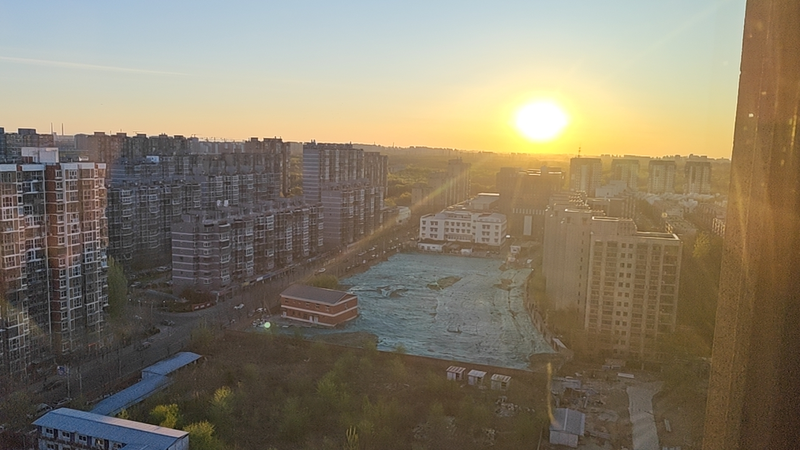
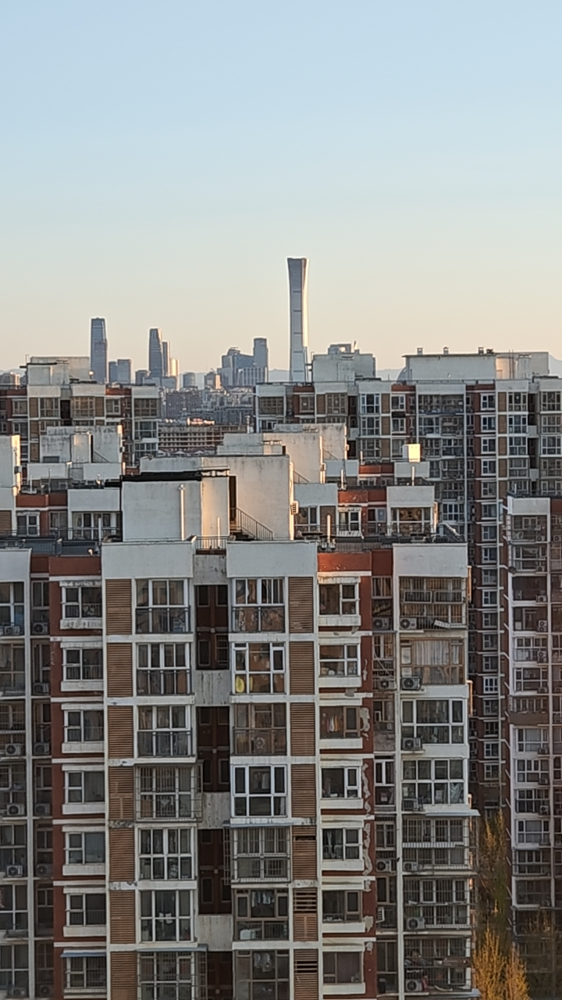
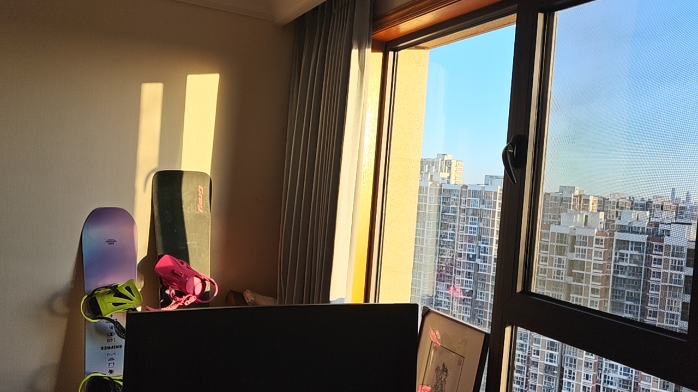

# 晨光记

*2026年4月7日 清晨*
*北京*

---

## 壹 · 破晓

晨曦破晓，天空从清冷的蓝调渐次过渡到金色。画面左侧是密密麻麻的高层住宅楼，灰白的混凝土与红砖交错，窗格如棋；右侧是中国尊——北京最高点，在朝阳中投下修长的影子。画面前景是一片蓝色防尘网覆盖的工地，小小的红砖老楼孤零零立在一旁，像是城市更新浪潮中最后一位不肯退场的长者。

## 贰 · 金时

金色时刻。斜阳以极低的角度切入，万千窗棂同时亮起，如同谁在夜空下点燃了满城灯火。光线从右侧倾泻，左侧建筑陷入柔和的阴影，肌理在明暗交界处尽显。这是黄昏还是清晨？都不是——这是城市在告诉人：时间还在，光还在。

## 叁 · 晨读

窗含西山三千丈——不如清晨一缕光。

这一张是今日最珍贵的。朝阳顺着洒入书房，墙面上留下两道明亮的矩形光斑。窗外的城市在晨光中醒来，密密麻麻的高楼铺展至天际线。而书房内，左边是两块雪板——一块紫蓝渐变（SKIFREE 140），一块酷黑（Gray），右边是一幅粉红点缀的画框。屏幕显示着待处理的工作，而阳光已经先一步抵达。

即将赴美。此刻书房里的光，是出发前最温柔的注脚。

---

## 晨光三帖

**其一**
晨曦破晓出云端，
金色铺陈满长安。
中国尊前光万丈，
此心悠然共天宽。

**其二**
斜阳染尽万家灯，
金色如潮涌北京。
此光一寸千金价，
换我心湖日日清。

**其三**
窗含西山三千丈，
不如清晨一缕光。
书案铺成黄金地，
此心安处是吾乡。

---

*早起的馈赠。别人还在睡，你已经收获了整个早晨。*
